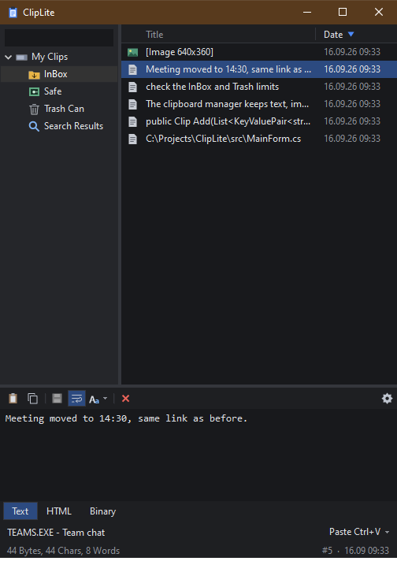
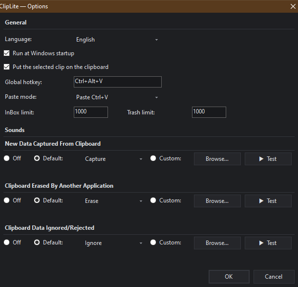

# ClipLite

A lightweight clipboard manager for Windows, in the spirit of **ClipMate**. One 244 KB executable — no installer, no dependencies to download, no network access at all.

[](LICENSE)


🇺🇦 [Читати українською](README.uk.md)



## What it does

Everything you copy lands in a searchable history. Pick an entry and it goes straight back onto the clipboard, so a plain <kbd>Ctrl</kbd>+<kbd>V</kbd> in any application pastes it — or press <kbd>Enter</kbd> and ClipLite pastes it into the window you came from.

## Features

- **Captures everything** — plain text, rich text (HTML and RTF), images and file lists, each clip keeping every format it was copied with.
- **Three collections** — *InBox* fills automatically, *Safe* holds what you want to keep and is never trimmed by the size limit, *Trash* catches what falls out of the InBox.
- **Global hotkey** — <kbd>Ctrl</kbd>+<kbd>Alt</kbd>+<kbd>V</kbd> by default, configurable.
- **Built-in editor** — fix a clip before pasting it, with plain-text copy/cut/paste and five case conversions (lower, UPPER, Mixed, Sentence, iNVERT) on ClipMate's own shortcuts.
- **Search and sorting** — full-text search across all collections; sort by title or date, direction toggles on a second click of the column header.
- **Event sounds** — separate sounds for *captured*, *clipboard erased by another application* and *ignored/rejected*; four built-in sounds or any WAV of your own.
- **Respects password managers** — clipboard data marked `ExcludeClipboardContentFromMonitorProcessing`, `Clipboard Viewer Ignore` or `CanIncludeInClipboardHistory=0` is never stored. KeePass, Bitwarden, 1Password and Windows' own "sensitive" flag are all covered.
- **Bilingual** — English and Ukrainian, switchable without a restart.
- **Stays out of the way** — dark theme, DPI-aware, tray-only (no taskbar button), optional autostart.

## Install

1. Download `ClipLite.exe` from the [Releases](https://github.com/googenetics/ClipLite/releases) page.
2. Put it anywhere you like and run it. There is no installer and nothing is written outside your user profile.

Requires Windows 7 SP1 or newer with .NET Framework 4.0+ — already part of Windows 8 and later.

**Portable mode:** create an empty file named `portable` next to the executable, and ClipLite keeps its data in a `data\` folder beside itself instead of in `%APPDATA%`.

## Shortcuts

| Key | Action |
| --- | --- |
| <kbd>Ctrl</kbd>+<kbd>Alt</kbd>+<kbd>V</kbd> | Show / hide ClipLite (works anywhere) |
| <kbd>Enter</kbd> | Paste the selected clip into the previous window |
| <kbd>Ctrl</kbd>+<kbd>C</kbd> | Copy the selected clip to the clipboard |
| <kbd>Del</kbd> / <kbd>Shift</kbd>+<kbd>Del</kbd> | Move to Trash / delete permanently |
| <kbd>F2</kbd> | Rename a clip |
| <kbd>Ctrl</kbd>+<kbd>F</kbd> | Search |
| <kbd>Ctrl</kbd>+<kbd>S</kbd> | Save editor changes |
| <kbd>Ctrl</kbd>+<kbd>,</kbd> | Options |
| <kbd>Esc</kbd> | Hide the window |
| <kbd>Ctrl</kbd>+<kbd>Alt</kbd>+<kbd>L</kbd> / <kbd>U</kbd> / <kbd>M</kbd> / <kbd>S</kbd> / <kbd>I</kbd> | lower case / UPPER CASE / Mixed Case / Sentence case. / iNVERT cASE |

## Options



Language, autostart, the global hotkey, paste mode, collection limits and all event sounds live in one window — tray icon → *Options…*, the gear button in the editor toolbar, or <kbd>Ctrl</kbd>+<kbd>,</kbd>.

## Where your data lives

```
%APPDATA%\ClipLite\
  settings.ini
  crash.log
  clips\InBox\  clips\Safe\  clips\Trash\   →  one .clp file per clip
```

Worth knowing before you trust it with anything sensitive:

- Clips are stored **unencrypted**. Anything running under your Windows account can read them.
- Deleting a clip moves it to *Trash* first; permanent deletion unlinks the file without wiping the bytes.
- The InBox and Trash limits (1000 clips each by default) count **clips, not bytes**.
- Nothing ever leaves your machine — the app makes no network calls of any kind.

## Build from source

```bat
build.cmd
```

Compiles with the C# compiler that ships with .NET Framework (`%WINDIR%\Microsoft.NET\Framework64\v4.0.30319\csc.exe`), so no SDK or IDE is required. The four WAV files in `assets\sounds\` are embedded into the executable as resources.

Note that `build.cmd` refuses to run while ClipLite is open — overwriting the executable of a running .NET process corrupts it. Exit from the tray first.

## License

[MIT](LICENSE) © 2026 googenetics

The event sounds in `assets/sounds` are synthesised from scratch for this project — see `tools/synth_sounds.py`.
