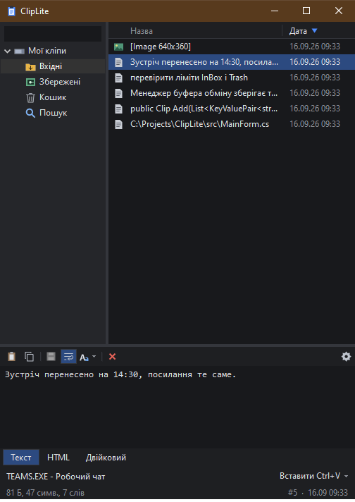
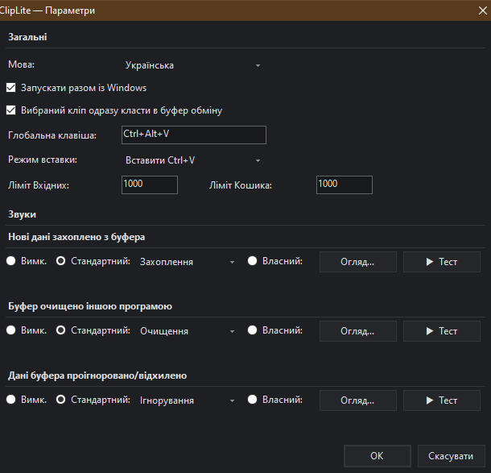

# ClipLite

Легкий менеджер буфера обміну для Windows у дусі **ClipMate**. Один файл на 244 КБ — без інсталятора, без залежностей і взагалі без доступу до мережі.

[](LICENSE)


🇬🇧 [Read in English](README.md)



## Що він робить

Усе скопійоване потрапляє в історію з пошуком. Вибери запис — і він одразу лягає назад у буфер обміну, тож звичайний <kbd>Ctrl</kbd>+<kbd>V</kbd> у будь-якій програмі вставить саме його. Або натисни <kbd>Enter</kbd>, і ClipLite сам вставить його у вікно, з якого ти прийшов.

## Можливості

- **Зберігає все** — простий текст, форматований (HTML і RTF), зображення та списки файлів; кожен кліп тримає всі формати, з якими його скопіювали.
- **Три колекції** — *Вхідні* наповнюються самі, *Збережені* тримають те, що має лишитися назавжди, і ліміт їх ніколи не обрізає, а *Кошик* приймає те, що випало з Вхідних.
- **Глобальна клавіша** — <kbd>Ctrl</kbd>+<kbd>Alt</kbd>+<kbd>V</kbd> за замовчуванням, змінюється в параметрах.
- **Вбудований редактор** — виправ кліп перед вставкою: копіювання, вирізання й вставка чистим текстом і п'ять режимів зміни регістру (нижній, ВЕРХНІЙ, Кожне Слово, Як у реченні, іНВЕРТУВАТИ) на тих самих клавішах, що в ClipMate.
- **Пошук і сортування** — пошук по всіх колекціях; сортування за назвою чи датою, напрямок перемикає другий клік по заголовку стовпця.
- **Звуки подій** — окремі для *захоплено*, *буфер очищено іншою програмою* та *проігноровано*; чотири вбудовані або будь-який власний WAV.
- **Поважає менеджери паролів** — дані з позначками `ExcludeClipboardContentFromMonitorProcessing`, `Clipboard Viewer Ignore` чи `CanIncludeInClipboardHistory=0` не зберігаються ніколи. Це покриває KeePass, Bitwarden, 1Password і власну позначку «конфіденційно» від Windows.
- **Дві мови** — українська та англійська, перемикаються без перезапуску.
- **Не заважає** — темна тема, підтримка високої роздільності, лише іконка в треї (без кнопки на панелі завдань), автозапуск за бажанням.

## Встановлення

1. Завантаж `ClipLite.exe` зі сторінки [Releases](https://github.com/googenetics/ClipLite/releases).
2. Поклади куди завгодно й запусти. Інсталятора немає, поза твоїм профілем користувача нічого не пишеться.

Потрібна Windows 7 SP1 або новіша з .NET Framework 4.0+ — у Windows 8 і новіших він уже вбудований.

**Portable-режим:** створи поруч з exe порожній файл з назвою `portable`, і ClipLite триматиме дані в папці `data\` поряд із собою, а не в `%APPDATA%`.

## Гарячі клавіші

| Клавіші | Дія |
| --- | --- |
| <kbd>Ctrl</kbd>+<kbd>Alt</kbd>+<kbd>V</kbd> | Показати / сховати ClipLite (працює будь-де) |
| <kbd>Enter</kbd> | Вставити вибраний кліп у попереднє вікно |
| <kbd>Ctrl</kbd>+<kbd>C</kbd> | Скопіювати вибраний кліп у буфер |
| <kbd>Del</kbd> / <kbd>Shift</kbd>+<kbd>Del</kbd> | У Кошик / видалити назавжди |
| <kbd>F2</kbd> | Перейменувати кліп |
| <kbd>Ctrl</kbd>+<kbd>F</kbd> | Пошук |
| <kbd>Ctrl</kbd>+<kbd>S</kbd> | Зберегти зміни в редакторі |
| <kbd>Ctrl</kbd>+<kbd>,</kbd> | Параметри |
| <kbd>Esc</kbd> | Сховати вікно |
| <kbd>Ctrl</kbd>+<kbd>Alt</kbd>+<kbd>L</kbd> / <kbd>U</kbd> / <kbd>M</kbd> / <kbd>S</kbd> / <kbd>I</kbd> | нижній регістр / ВЕРХНІЙ РЕГІСТР / Кожне Слово З Великої / Як у реченні. / іНВЕРТУВАТИ рЕГІСТР |

## Параметри



Мова, автозапуск, глобальна клавіша, режим вставки, ліміти колекцій і всі звуки подій зібрані в одному вікні: іконка в треї → *Параметри…*, кнопка-шестірня на панелі редактора або <kbd>Ctrl</kbd>+<kbd>,</kbd>.

## Де зберігаються дані

```
%APPDATA%\ClipLite\
  settings.ini
  crash.log
  clips\InBox\  clips\Safe\  clips\Trash\   →  один файл .clp на кліп
```

Що варто знати, перш ніж довіряти йому чутливе:

- Кліпи зберігаються **без шифрування**. Їх прочитає будь-що, запущене під твоїм обліковим записом Windows.
- Видалення кліпа спершу переносить його в *Кошик*; остаточне видалення знімає посилання на файл, не затираючи байти.
- Ліміти Вхідних і Кошика (типово 1000 кліпів на кожен) рахують **кліпи, а не байти**.
- Нічого не залишає твій комп'ютер — програма не робить жодних мережевих запитів.

## Збірка з вихідного коду

```bat
build.cmd
```

Збирається компілятором C#, що входить до .NET Framework (`%WINDIR%\Microsoft.NET\Framework64\v4.0.30319\csc.exe`), тож ні SDK, ні середовище розробки не потрібні. Чотири WAV з `assets\sounds\` вбудовуються в exe як ресурси.

Зверни увагу: `build.cmd` відмовляється працювати, поки ClipLite запущений — перезапис exe працюючого .NET-процесу пошкоджує його. Спершу вийди через трей.

## Ліцензія

[MIT](LICENSE) © 2026 googenetics

Звуки подій у `assets/sounds` синтезовані з нуля для цього проєкту — див. `tools/synth_sounds.py`.
